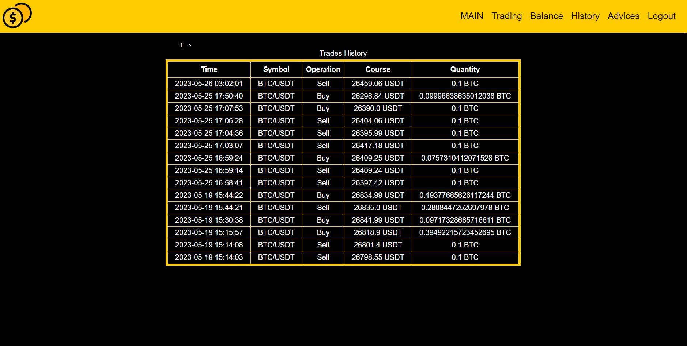

# JavaBinance

JavaBinance is a Spring Boot application for trading on the 
cryptocurrency exchange, which will allow the user to learn how to make 
transactions, analyze them and try various strategies without the risk 
of losing material assets.

## Deploy
- Install Java 17
- Install PostgreSQL
- Rename `application.origins.properties` to `application.properties`, set spring.datasource.password
- Create database with name `java_binance` or change `spring.datasource.url` in application.properties
- `psql -d java_binance -f init.sql`
- Run

Server should start on `localhost:8080`

## Deploy with docker
- Download docker
- Open console in project root folder
- Run command `docker-compose up`

Server should start on `localhost:8080`

*But port for postgre database are close, you can open it in docker-compose.yml*

## Screenshots

